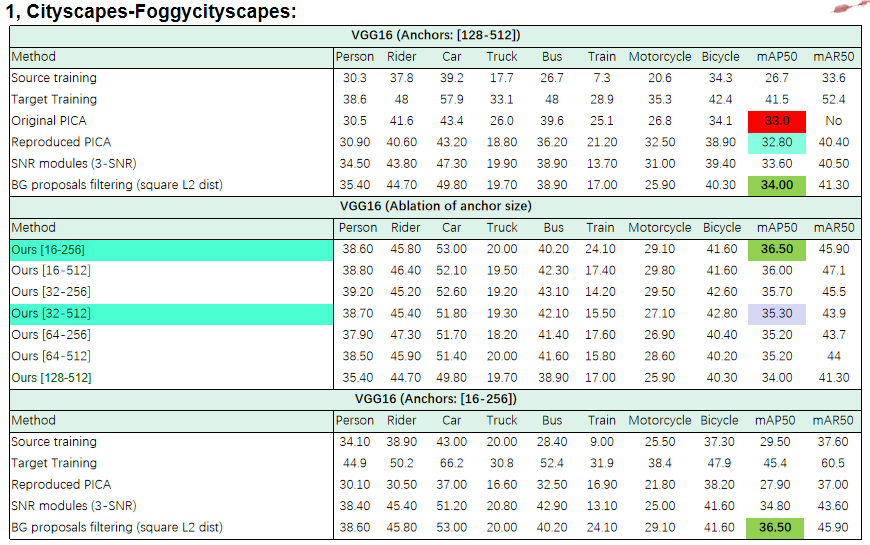
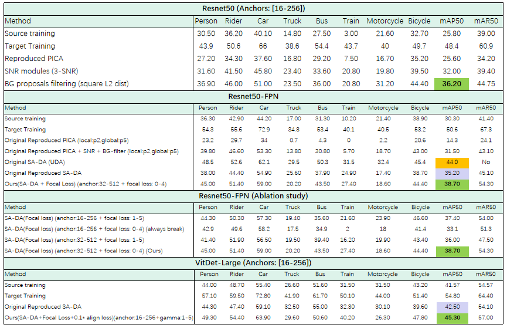
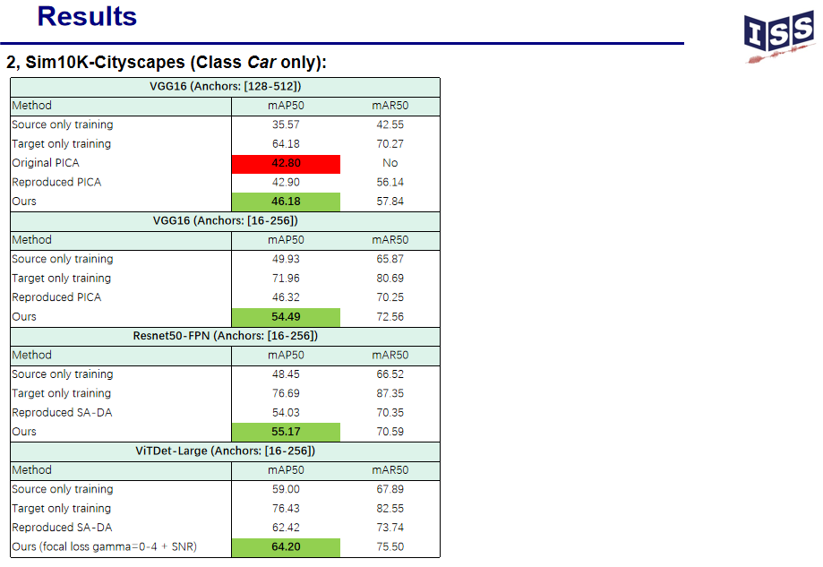
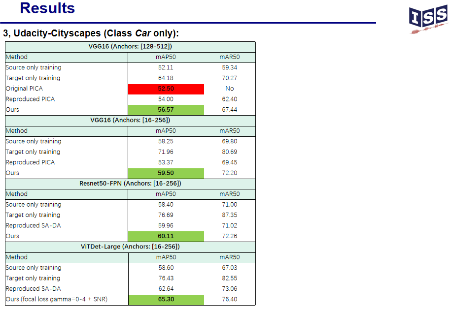

# Few-Shot_Domain_Adaptative_Object_Detection_via_Adversarial_Learning
Master-Thesis at Bosch

## Model

## Results

**1. DA from CityScapes to FoggyCityScapes: Reduce the domain-shift caused by Fog.**

**2. DA from Sim10K to CityScapes: Reduce the domain-shift caused by Simulation-Effect.**

**3. DA from Udacity to CityScapes: Reduce the domain-shift caused by different Camera-Settings.**

## TO DO
Code
